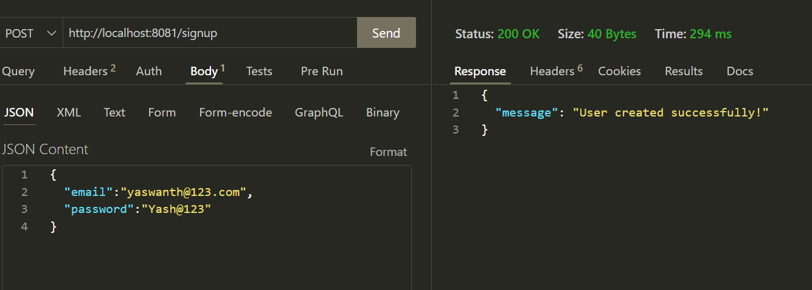
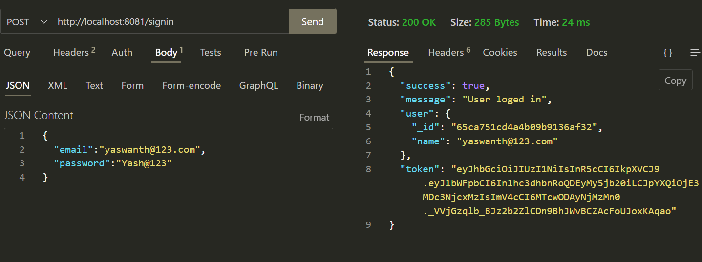
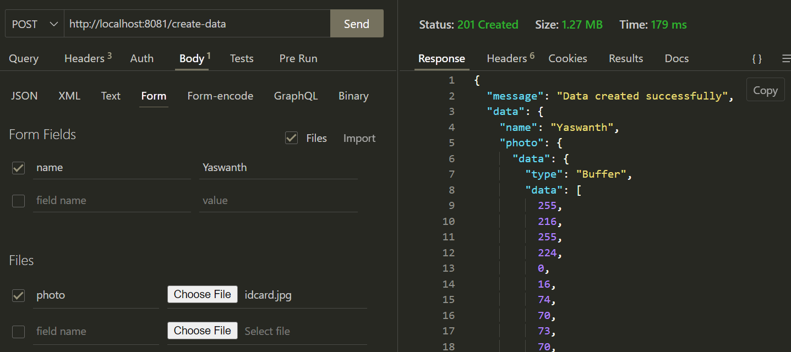
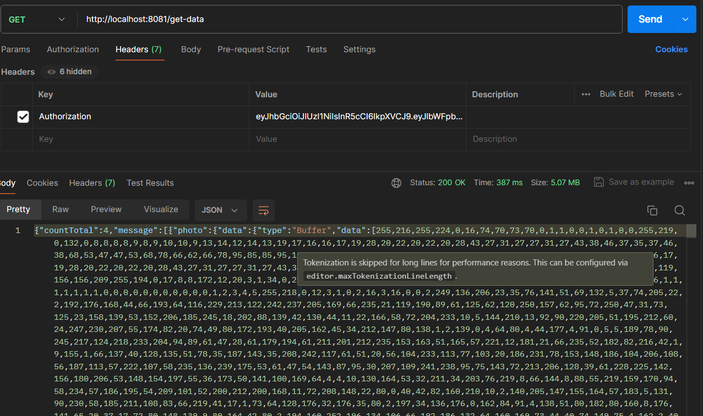

# BlinkIt Task - 1

## Description

Web application that allows users to register, sign in, upload images, and retrieve image data using APIs.

## Installation

1. Clone the repository: `git clone https://github.com/Yaswanth14/blinkit-task.git`
2. Navigate to the project directory: `cd blinkit-task`
3. Install dependencies: `npm install`
4. Create a `.env` file and add MONGO_URL and JWT_SECRET
5. Start the server: `npm start`

## Usage

1. Register as a new user using the `/signup` endpoint.
2. Sign in with your credentials using the `/signin` endpoint.
3. Upload images using the `/create-data` endpoint.
4. Retrieve image data using the `/get-data` endpoint.

### API Endpoints

#### Signup

**Endpoint:** `POST /signup`

**Request Body:**

```json
{
  "email": "example@user.com",
  "password": "examplepassword"
}
```

**Response:**

```json
{
  "message": "User registered successfully"
}
```

#### Signin:

**Endpoint:** POST /signin

**Request Body:**

```json
{
  "email": "example@user.com",
  "password": "examplepassword"
}
```

**Response:**

```json
{
  "message": "User signed in succesfully",
  "token": "exlas5dfjlskddffhaslaslfh..."
}
```

#### Create Data

**Endpoint:** `POST /create-data`

**Request Body:**

```form
{
  "name": "example",
  "photo": (image file)
}
```

**Request Header:**

```
Authorization: Bearer {access_token}
```

**Response:**

```json
{
  "message": "Data created succesfully",
  "data": {
    "name": "example",
    "photo": "Buffer 1 23 d 34 ..."
  }
}
```

#### Get Data

**Endpoint:** `GET /get-data`

**Request Header:**

```
Authorization: Bearer {access_token}
```

**Response:**

```json
{
  "dataSize": "4",
  "data": {
    {
    "name": "example",
    "photo": "Buffer 1 23 d 34 ..."
    },
    {...},
  }
}
```

## Screenshots

| Signup                              | Signin                              | Create Data                                  | Get Data                             |
| ----------------------------------- | ----------------------------------- | -------------------------------------------- | ------------------------------------ |
|  |  |  |  |
